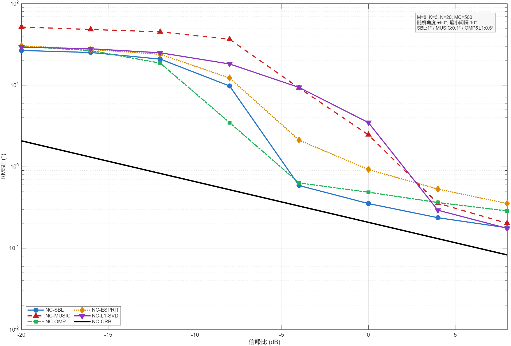
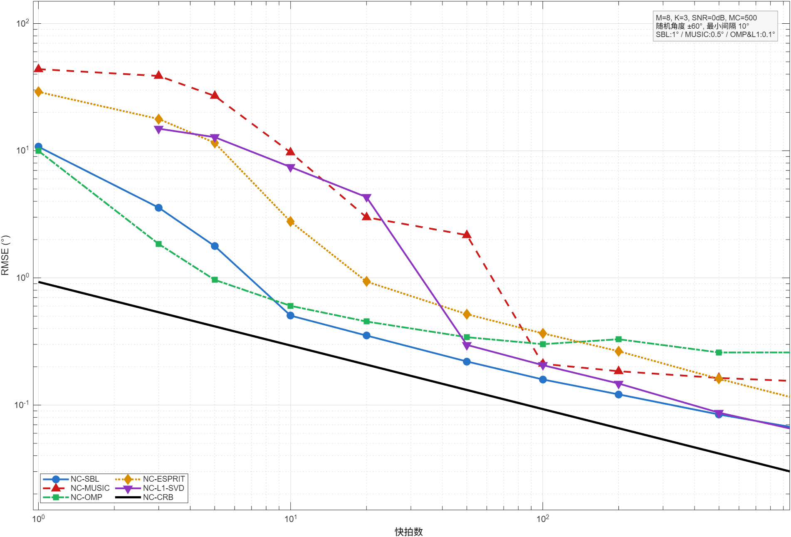
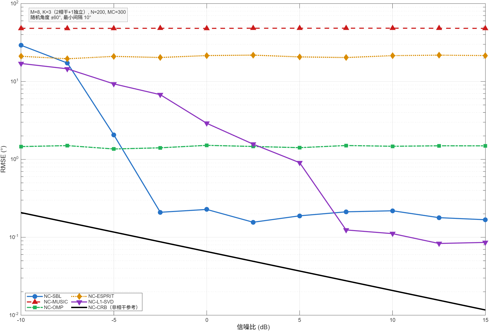

# NC-DOA：基于非圆信号扩展的 DOA 估计算法仿真平台

本项目实现并系统比较了五种基于**非圆（Non-Circular, NC）信号扩展**的波达方向（DOA）估计算法，涵盖子空间类、稀疏重构类与贝叶斯类方法，并与非圆 Cramér-Rao 下界（NC-CRB）对比，全面评估各算法在不同场景下的估计性能。

---

## 算法一览

| 算法 | 类别 | 特点 |
|------|------|------|
| **NC-ESPRIT** | 子空间类 | 无需网格，解析求解，计算高效 |
| **NC-MUSIC** | 子空间类 | 谱峰搜索，高分辨率，相干源失效 |
| **NC-OMP** | 稀疏重构类 | 贪婪迭代，单快拍可用，受网格误差限制 |
| **NC-L1-SVD** | 稀疏重构类 | 凸优化，无阈值效应，强相干鲁棒性 |
| **NC-SBL** | 贝叶斯类 | 自动定阶，off-grid 细化，综合性能最优 |

所有算法均利用非圆扩展将协方差矩阵维度从 $M$ 扩展到 $2M$，有效自由度上限为 $2N-1$。

---

## 项目结构

```
final_code/
├── functions/                      # 核心算法函数
│   ├── NC_ESPRIT.m                 # NC-ESPRIT 算法
│   ├── NC_MUSIC.m                  # NC-MUSIC 算法
│   ├── NC_OMP.m                    # NC-OMP 算法
│   ├── NC_L1_SVD.m                 # NC-L1-SVD 算法
│   ├── NC_SBL.m                    # NC-SBL 算法（含 off-grid 牛顿细化）
│   ├── compute_NC_CRB.m            # NC-CRB 计算（外部接口）
│   ├── compute_NC_CRB_internal.m   # NC-CRB 计算（内部实现）
│   └── generate_angles.m           # 随机角度生成（最小间隔约束）
│
└── simulations/                    # 仿真脚本
    ├── NC_DOA_comparison/          # 五算法综合对比
    │   ├── DOA_benchmark.m         # RMSE vs SNR 对比
    │   ├── DOA_benchmark2.m        # RMSE vs 快拍数对比
    │   └── DOA_benchmark_coherent.m # 相干源场景对比
    ├── ESPRIT/                     # NC-ESPRIT 专项仿真
    ├── MUSIC/                      # NC-MUSIC 专项仿真
    ├── OMP/                        # NC-OMP 专项仿真
    ├── L1_SVD/                     # NC-L1-SVD 专项仿真
    └── SBL/                        # NC-SBL 专项仿真
```

---

## 环境要求

- **MATLAB R2019b 或更高版本**
- 工具箱依赖：
  - Signal Processing Toolbox（`findpeaks`）
  - Optimization Toolbox（NC-L1-SVD 的凸优化求解）
  - Parallel Computing Toolbox（可选，`parpool` 加速 Monte Carlo 仿真）

---

## 快速开始

**1. 克隆仓库并添加路径**

```matlab
% 在 MATLAB 中执行
addpath(genpath('path/to/final_code'));
```

**2. 运行五算法综合对比**

```matlab
cd simulations/NC_DOA_comparison
run('DOA_benchmark.m')        % RMSE vs SNR（约 3~5 分钟）
run('DOA_benchmark2.m')       % RMSE vs 快拍数
run('DOA_benchmark_coherent.m') % 相干源场景
```

**3. 运行单算法专项仿真**

```matlab
cd simulations/ESPRIT
run('NC_ESPRIT_simulation_1.m')   % 单次估计可视化
run('NC_ESPRIT_DoF_test.m')       % 自由度压力测试
```

---

## 核心仿真参数

| 参数 | 默认值 |
|------|--------|
| 阵元数 $M$ | 8 |
| 信源数 $K$ | 3 |
| 快拍数 $N$ | 200 |
| Monte Carlo 次数 | 500 |
| SNR 范围 | −20 dB ～ +10 dB |
| 角度范围 | −60° ～ +60°，最小间隔 10° |

---

## 主要仿真结论

### RMSE vs SNR
- 极低信噪比（SNR < −13 dB）下，五种算法性能差异不显著
- **NC-SBL** 阈值点最低（约 −10 dB），渐近精度最优
- **NC-MUSIC / NC-ESPRIT** 子空间类方法阈值效应明显，高 SNR 段性能良好
- **NC-L1-SVD / NC-OMP** 无阈值效应，但受网格量化误差限制

### RMSE vs 快拍数
- **NC-SBL / NC-OMP** 在少快拍段（$K < 10$）收敛最快
- 稀疏类方法对快拍数的利用效率显著优于子空间类方法

### 相干源场景
- **NC-MUSIC** 完全失效（协方差矩阵秩亏）
- **NC-ESPRIT** 性能严重退化
- **NC-SBL / NC-L1-SVD / NC-OMP** 对强相干源（$\rho = 0.9$）具有良好鲁棒性

### 自由度测试
- 理论自由度上限 $2N-1 = 15$
- NC-ESPRIT 实际可靠工作范围：$K \leq 13$
- NC-SBL 实际可靠工作范围：$K \leq 12$（峰值检测门限制约）

---

## 函数接口说明

```matlab
% NC-ESPRIT
est_theta = NC_ESPRIT(Y, K_source)

% NC-MUSIC
[P_db, est_theta] = NC_MUSIC(Y, grid_theta, M_source)

% NC-OMP
[gamma, est_theta] = NC_OMP(Y, A_dict, grid_theta, K_source)

% NC-L1-SVD
[gamma, est_theta] = NC_L1_SVD(Y, A_dict, grid_theta, K_source, sigma2, opts)

% NC-SBL（自动检测信源数，无需指定 K）
est_theta = NC_SBL(Y, grid_theta)
```

参数说明：

- `Y`：接收数据矩阵，尺寸为 $M \times N$（阵元数 × 快拍数）
- `grid_theta`：角度搜索网格（度），如 `-90:0.5:90`
- `K_source`：信源数
- `sigma2`：噪声方差估计值

---

## 仿真结果展示

### RMSE vs SNR（含 NC-CRB 下界）


### RMSE vs 快拍数


### 相干源场景对比


其余算法函数的单独仿真结果在results里。